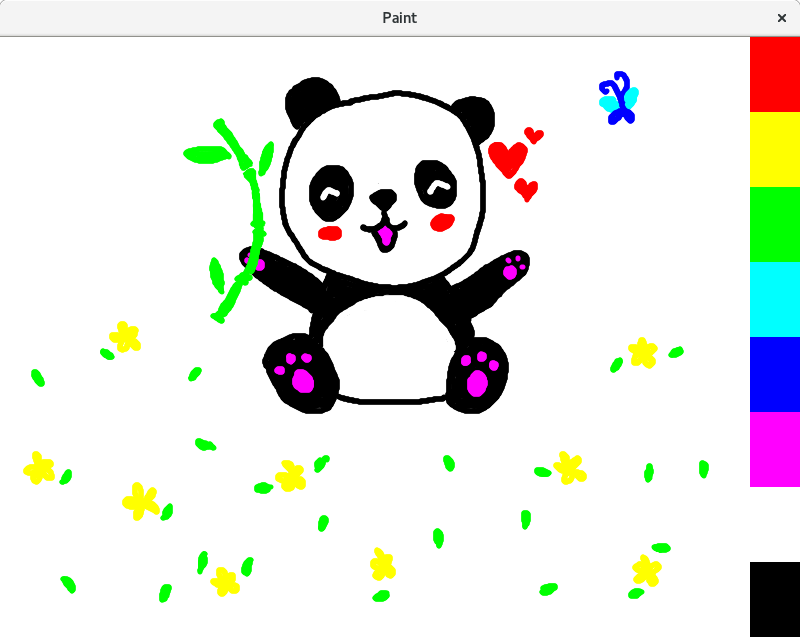
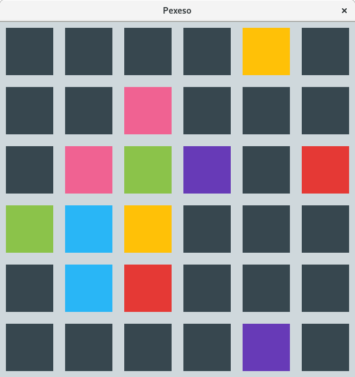
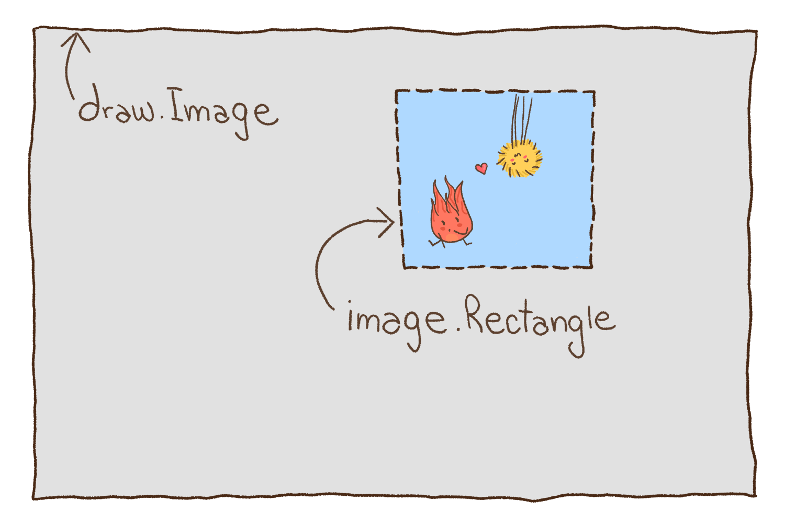
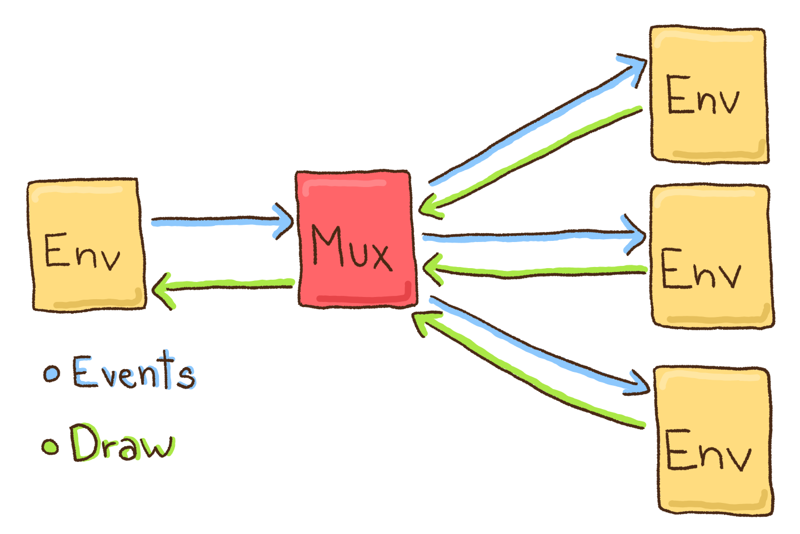
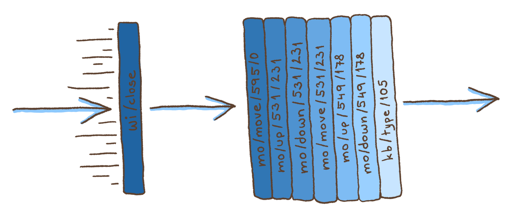

# faiface/gui [](https://godoc.org/github.com/faiface/gui) [](https://discord.gg/T5YAAT2)

Super minimal, rock-solid foundation for concurrent GUI in Go.

## Installation

```
go get -u github.com/faiface/gui
```

Currently uses [GLFW](https://www.glfw.org/) under the hood, so have [these dependencies](https://github.com/go-gl/glfw#installation).

## Why concurrent GUI?

GUI is concurrent by nature. Elements like buttons, text fields, or canvases are conceptually independent. Conventional GUI frameworks solve this by implementing huge architectures: the event
loop, call-backs, tickers, you name it.

In a concurrent GUI, the story is different. Each element is actually handled by its own goroutine,
or event multiple ones. Elements communicate with each other via channels.

This has several advantages:

- Make a new element at any time just by spawning a goroutine.
- Implement animations using simple for-loops.
- An intenstive computation in one element won't block the whole app.
- Enables decentralized design - since elements communicate via channels, multiple communications
  may be going on at once, without any central entity.

## Examples

| [Image Viewer](examples/imageviewer) | [Paint](examples/paint) | [Pexeso](examples/pexeso) |
| --- | --- | --- |
|  |  |  |

## What needs getting done?

This package is solid, but not complete. Here are some of the things that I'd love to get done with your help:

- Get rid of the C dependencies.
- Support multiple windows.
- Mobile support.
- A widgets/layout package.

Contributions are highly welcome!

## Overview

The idea of concurrent GUI pre-dates Go and is found in another language by Rob Pike called Newsqueak. He explains it quite nicely in [this talk](https://www.youtube.com/watch?v=hB05UFqOtFA&t=2408s). Newsqueak was similar to Go, mostly in that it had channels.

Why the hell has no one made a concurrent GUI in Go yet? I have no idea. Go is a perfect language for such a thing. Let's change that!

**This package is a minimal foundation for a concurrent GUI in Go.** It doesn't include widgets, layout systems, or anything like that. The main reason is that I am not yet sure how to do them most correctly. So, instead of providing a half-assed, "fully-featured" library, I decided to make a small, rock-solid package, where everything is right.

**So, how does this work?**

The main idea is that different components of the GUI (buttons, text fields, ...) run concurrently and communicate using channels. Furthermore, they receive events from an object called _environment_ and can draw by sending draw commands to it.

Here's [`Env`](https://godoc.org/github.com/faiface/gui#Env0), short for environment:

```go
type Env interface {
	Events() <-chan Event
	Draw() chan<- func(draw.Image) image.Rectangle
}
```

It's something that produces events (such as mouse clicks and key presses) and accepts draw commands.

Closing the `Draw()` channel destroys the environment. When destroyed (either by closing the `Draw()` channel or by any other reason), the environment will always close the `Events()` channel.

As you can see, a draw command is a function that draws something onto a [`draw.Image`](https://golang.org/pkg/image/draw/#Image) and returns a rectangle telling which part got changed.

If you're not familiar with the `"image"` and the `"image/draw"` packages, go read [this short entry in the Go blog](https://blog.golang.org/go-imagedraw-package).



Yes, `faiface/gui` uses CPU for drawing. You won't make AAA games with it, but the performance is enough for most GUI apps. The benefits are outstanding, though:

1. Drawing is as simple as changing pixels.
2. No FPS (frames per second), results are immediately on the screen.
3. No need to organize the API around a GPU library, like OpenGL.
4. Use all the good packages, like [`"image"`](https://golang.org/pkg/image/), [`"image/draw"`](https://golang.org/pkg/image/draw/), [`"golang.org/x/image/font"`](https://godoc.org/golang.org/x/image/font) for fonts, or [`"github.com/fogleman/gg"`](https://godoc.org/github.com/fogleman/gg) for shapes.

What is an [`Event`](https://godoc.org/github.com/faiface/gui#Event)? It's an interface:

```go
type Event interface {
	String() string
}
```

This purpose of this interface is to hold different kinds of events and be able to discriminate among them using a type switch.

Examples of concrete `Event` types are: [`gui.Resize`](https://godoc.org/github.com/faiface/gui#Resize), [`win.WiClose`](https://godoc.org/github.com/faiface/gui/win#WiClose), [`win.MoDown`](https://godoc.org/github.com/faiface/gui/win#MoDown), [`win.KbType`](https://godoc.org/github.com/faiface/gui/win#KbType) (where `Wi`, `Mo`, and `Kb` stand for _window_, _mouse_, and _keyboard_, respectively). When we have an `Event`, we can type switch on it like this:

```go
switch event := event.(type) {
case gui.Resize:
    // environment resized to event.Rectangle
case win.WiClose:
    // window closed
case win.MoMove:
    // mouse moved to event.Point
case win.MoDown:
    // mouse button event.Button pressed on event.Point
case win.MoUp:
	// mouse button event.Button released on event.Point
case win.MoScroll:
	// mouse scrolled by event.Point
case win.KbType:
    // rune event.Rune typed on the keyboard
case win.KbDown:
    // keyboard key event.Key pressed on the keyboard
case win.KbUp:
    // keyboard key event.Key released on the keyboard
case win.KbRepeat:
    // keyboard key event.Key repeated on the keyboard (happens when held)
}
```

This shows all the possible events that a window can produce.

The [`gui.Resize`](https://godoc.org/github.com/faiface/gui#Resize) event is not from the package [`win`](https://godoc.org/github.com/faiface/gui/win) because it's not window specific. In fact, every `Env` guarantees to produce `gui.Resize` as its first event.

How do we create a window? With the [`"github.com/faiface/gui/win"`](https://godoc.org/github.com/faiface/gui/win) package:

```go
// import "github.com/faiface/gui/win"
w, err := win.New(win.Title("faiface/win"), win.Size(800, 600), win.Resizable())
```

The [`win.New`](https://godoc.org/github.com/faiface/gui/win#New) constructor uses the [functional options pattern](https://dave.cheney.net/2014/10/17/functional-options-for-friendly-apis) by Dave Cheney. Unsurprisingly, the returned [`*win.Win`](https://godoc.org/github.com/faiface/gui/win#Win) is an `Env`.

Due to stupid limitations imposed by operating systems, the internal code that fetches events from the OS must run on the main thread of the program. To ensure this, we need to call [`mainthread.Run`](https://godoc.org/github.com/faiface/mainthread#Run) in the `main` function:

```go
import "github.com/faiface/mainthread"

func run() {
    // do everything here, this becomes the new main function
}

func main() {
    mainthread.Run(run)
}
```

How does it all look together? Here's a simple program that displays a nice, big rectangle in the middle of the window:

```go
package main

import (
	"image"
	"image/draw"

	"github.com/faiface/gui/win"
	"github.com/faiface/mainthread"
)

func run() {
	w, err := win.New(win.Title("faiface/gui"), win.Size(800, 600))
	if err != nil {
		panic(err)
	}

	w.Draw() <- func(drw draw.Image) image.Rectangle {
		r := image.Rect(200, 200, 600, 400)
		draw.Draw(drw, r, image.White, image.ZP, draw.Src)
		return r
	}

	for event := range w.Events() {
		switch event.(type) {
		case win.WiClose:
			close(w.Draw())
		}
	}
}

func main() {
	mainthread.Run(run)
}
```

### Muxing

When you receive an event from the `Events()` channel, it gets removed from the channel and no one else can receive it. But what if you have a button, a text field, four switches, and a bunch of other things that all want to receive the same events?

That's where multiplexing, or muxing comes in.



A [`Mux`](https://godoc.org/github.com/faiface/gui#Mux) basically lets you split a single `Env` into multiple ones.

When the original `Env` produces an event, `Mux` sends it to each one of the multiple `Env`s.

When any one of the multiple `Env`s receives a draw function, `Mux` sends it to the original `Env`.

To mux an `Env`, use [`gui.NewMux`](https://godoc.org/github.com/faiface/gui#NewMux):

```go
mux, env := gui.NewMux(w)
```

Here we muxed the window `Env` stored in the `w` variable.

What's that second return value? That's the _master `Env`_. It's the first environment that the mux creates for us. It has a special role: if you close its `Draw()` channel, you close the `Mux`, all other `Env`s created by the `Mux`, and the original `Env`. But other than that, it's just like any other `Env` created by the `Mux`.

Don't use the original `Env` after muxing it. The `Mux` is using it and you'll steal its events at best.

To create more `Env`s, we can use [`mux.MakeEnv()`](https://godoc.org/github.com/faiface/gui#Mux.MakeEnv):

For example, here's a simple program that shows four white rectangles on the screen. Whenever the user clicks on any of them, the rectangle blinks (switches between white and black) 3 times. We use `Mux` to send events to all of the rectangles independently:

```go
package main

import (
	"image"
	"image/draw"
	"time"

	"github.com/faiface/gui"
	"github.com/faiface/gui/win"
	"github.com/faiface/mainthread"
)

func Blinker(env gui.Env, r image.Rectangle) {
	// redraw takes a bool and produces a draw command
	redraw := func(visible bool) func(draw.Image) image.Rectangle {
		return func(drw draw.Image) image.Rectangle {
			if visible {
				draw.Draw(drw, r, image.White, image.ZP, draw.Src)
			} else {
				draw.Draw(drw, r, image.Black, image.ZP, draw.Src)
			}
			return r
		}
	}

	// first we draw a white rectangle
	env.Draw() <- redraw(true)

	for event := range env.Events() {
		switch event := event.(type) {
		case win.MoDown:
			if event.Point.In(r) {
				// user clicked on the rectangle
				// we blink 3 times
				for i := 0; i < 3; i++ {
					env.Draw() <- redraw(false)
					time.Sleep(time.Second / 3)
					env.Draw() <- redraw(true)
					time.Sleep(time.Second / 3)
				}
			}
		}
	}

	close(env.Draw())
}

func run() {
	w, err := win.New(win.Title("faiface/gui"), win.Size(800, 600))
	if err != nil {
		panic(err)
	}

	mux, env := gui.NewMux(w)

	// we create four blinkers, each with its own Env from the mux
	go Blinker(mux.MakeEnv(), image.Rect(100, 100, 350, 250))
	go Blinker(mux.MakeEnv(), image.Rect(450, 100, 700, 250))
	go Blinker(mux.MakeEnv(), image.Rect(100, 350, 350, 500))
	go Blinker(mux.MakeEnv(), image.Rect(450, 350, 700, 500))

	// we use the master env now, w is used by the mux
	for event := range env.Events() {
		switch event.(type) {
		case win.WiClose:
			close(env.Draw())
		}
	}
}

func main() {
	mainthread.Run(run)
}
```

Just for the info, closing the `Draw()` channel on an `Env` created by `mux.MakeEnv()` removes the `Env` from the `Mux`.

What if one of the `Env`s hangs and stops consuming events, or if it simply takes longer to consume them? Will all the other `Env`s hang as well?

They won't, because the channels of events have unlimited capacity and never block. This is implemented using an intermediate goroutine that handles the queueing.



And that's basically all you need to know about `faiface/gui`! Happy hacking!

## A note on race conditions

There is no guarantee when a function sent to the `Draw()` channel will be executed, or if at all. Look at this code:

```go
pressed := false

env.Draw() <- func(drw draw.Image) image.Rectangle {
	// use pressed somehow
}

// change pressed somewhere here
```

The code above has a danger of a race condition. The code that changes the `pressed` variable and the code that uses it may run concurrently.

**My advice is to never enclose a shared variable in a drawing function.**

Instead, you can do this:

```go
redraw := func(pressed bool) func(draw.Image) image.Rectangle {
	return func(drw draw.Image) image.Rectangle {
		// use the pressed argument
	}
}

pressed := false

env.Draw() <- redraw(pressed)

// changing pressed here doesn't cause race conditions
```

## Credit

The cutest ever pictures are all drawn by Tori Bane! You can see more of her drawings and follow her on [Instagram here](https://www.instagram.com/teplomilka/).

## Licence

[MIT](LICENCE)
